# Fullstack Monorepo Architecture

```mermaid
graph TB
    %% Styling
    classDef appStyle fill:#e1f5fe,stroke:#01579b,stroke-width:2px,color:#000
    classDef packageStyle fill:#f3e5f5,stroke:#4a148c,stroke-width:2px,color:#000
    classDef dbStyle fill:#e8f5e8,stroke:#2e7d32,stroke-width:2px,color:#000
    classDef externalStyle fill:#fff3e0,stroke:#e65100,stroke-width:2px,color:#000
    classDef cloudStyle fill:#e3f2fd,stroke:#1565c0,stroke-width:2px,color:#000

    %% External Services
    subgraph External["☁️ External Services"]
        Turso[(Turso Database<br/>LibSQL)]
        CF[Cloudflare Workers<br/>Runtime]
        Expo[Expo Application<br/>Services]
        EmailService[Email Service<br/>Provider]
    end

    %% Main Monorepo Structure
    subgraph Monorepo["📦 Fullstack Monorepo (Turborepo + pnpm)"]

        %% Apps Section
        subgraph Apps["🚀 Applications"]
            API["`**API**
            Hono + OpenAPI
            Cloudflare Workers
            Better Auth Server
            Drizzle ORM`"]

            Web["`**Web App**
            React 19
            TanStack Router
            TanStack Query
            Tailwind CSS v4
            Better Auth Client`"]

            Mobile["`**Mobile App**
            Expo + React Native
            Expo Router
            NativeWind
            Better Auth Expo`"]

            EmailDesigner["`**Email Designer**
            Email Template
            Designer Tool`"]

            LocalDB["`**Local DB**
            Turso Local
            Development Setup`"]
        end

        %% Packages Section
        subgraph Packages["📚 Shared Packages"]
            APIClient["`**@fulleststack/api-client**
            Type-safe API client
            Generated from OpenAPI
            Shared across apps`"]

            Common["`**@fulleststack/common**
            Shared utilities
            Type definitions
            Business logic`"]

            UI["`**@fulleststack/ui**
            Shared UI utilities
            Component helpers
            Design system`"]

            Email["`**@fulleststack/email**
            React Email templates
            Email service layer
            Template management`"]

            ESLintConfig["`**@fulleststack/eslint-config**
            Shared ESLint rules
            Code style standards
            Consistent formatting`"]
        end

        %% Build Tools
        subgraph BuildTools["🔧 Build & Development"]
            Turbo[Turborepo<br/>Build Orchestration]
            PNPM[pnpm Workspaces<br/>Dependency Management]
            TS[TypeScript<br/>Shared Config]
        end
    end

    %% Connections - Apps to External Services
    API -.->|Deploy| CF
    API -.->|Connect| Turso
    API -.->|Send Emails| EmailService
    Mobile -.->|Deploy/Build| Expo
    LocalDB -.->|Mirror| Turso

    %% Connections - Apps to Packages
    API --> APIClient
    API --> Common
    API --> Email
    API --> ESLintConfig

    Web --> APIClient
    Web --> Common
    Web --> UI
    Web --> ESLintConfig

    Mobile --> APIClient
    Mobile --> Common
    Mobile --> UI
    Mobile --> ESLintConfig

    EmailDesigner --> Email
    EmailDesigner --> Common

    %% Package interdependencies
    APIClient --> Common
    UI --> Common
    Email --> Common

    %% Build tool connections
    Turbo -.->|Orchestrates| Apps
    Turbo -.->|Orchestrates| Packages
    PNPM -.->|Manages| Apps
    PNPM -.->|Manages| Packages
    TS -.->|Types| Apps
    TS -.->|Types| Packages

    %% Data Flow
    Web -->|HTTP Requests| API
    Mobile -->|HTTP Requests| API
    API -->|SQL Queries| Turso
    API -->|Auth Sessions| Turso

    %% Apply styles
    class API,Web,Mobile,EmailDesigner,LocalDB appStyle
    class APIClient,Common,UI,Email,ESLintConfig packageStyle
    class Turso,LocalDB dbStyle
    class CF,Expo,EmailService externalStyle
    class Turbo,PNPM,TS cloudStyle
```

## Architecture Overview

### 🏗️ **Monorepo Structure**

- **Build System**: Turborepo for build orchestration and task caching
- **Package Manager**: pnpm workspaces with version pinning
- **Language**: TypeScript with shared configuration
- **Linting**: Shared ESLint configuration with @antfu/eslint-config

### 🚀 **Applications**

#### API (Hono on Cloudflare Workers)

- **Framework**: Hono with OpenAPI integration
- **Authentication**: Better Auth with Drizzle adapter
- **Database**: Drizzle ORM with Turso (libSQL)
- **Documentation**: Scalar API docs auto-generated
- **Deployment**: Cloudflare Workers

#### Web App (React SPA)

- **Framework**: React 19 with TypeScript
- **Routing**: TanStack Router (file-based)
- **State**: TanStack Query for server state
- **Styling**: Tailwind CSS v4
- **Authentication**: Better Auth React client

#### Mobile App (Expo React Native)

- **Framework**: Expo with React Native
- **Routing**: Expo Router (file-based)
- **Styling**: NativeWind (Tailwind for RN)
- **Authentication**: Better Auth Expo client

### 📚 **Shared Packages**

#### @fulleststack/api-client

- Type-safe API client generated from OpenAPI specs
- Shared across web and mobile applications
- Automatic type inference from API routes

#### @fulleststack/common

- Shared utilities and business logic
- Common type definitions
- Validation schemas (Zod)

#### @fulleststack/ui

- Shared UI utilities and helpers
- Design system components
- Tailwind utilities (cn function)

#### @fulleststack/email

- React Email templates
- Email service abstractions
- Template management system

### 🔐 **Authentication Flow**

1. Better Auth server configuration in API
2. Database schema auto-generated via CLI
3. Role-based access control with statements
4. Session management across all platforms
5. Secure authentication flows for web and mobile

### 🗄️ **Database Architecture**

- **Primary**: Turso (libSQL) in production
- **Local**: Turso local instance for development
- **ORM**: Drizzle with automatic migrations
- **Schema**: Generated via drizzle-kit and better-auth CLI

### 🚀 **Deployment & Development**

- **API**: Cloudflare Workers with Wrangler
- **Web**: Static hosting (can be Cloudflare Pages)
- **Mobile**: Expo Application Services (EAS)
- **Database**: Turso cloud with edge replicas
